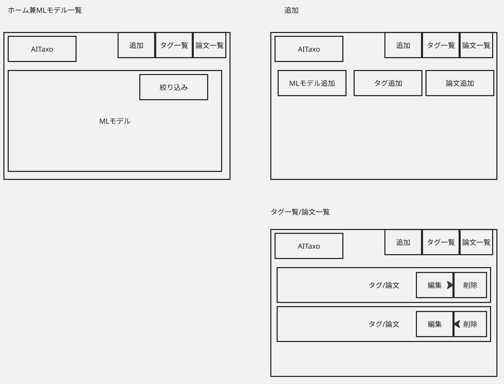
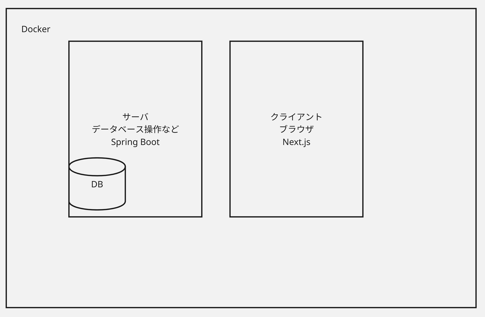

# 要件定義
- DB管理
  - AIモデルの分類を行う。
  - AIモデルにタグをつける(CNN, RNN, GNN, LLM, Tranformer)
  - タグの作成
  - AIモデルの作成
- Webアプリ
  - 外部ネットワークから使用可能
  - 研究室の一般コンピュータにデプロイ
- アーキテクチャ設計
- プロジェクトの透明性
  - 引き継ぎ可能
  - 後輩が保守できるように
  - README.mdにプログラムの概略を書く

# DB設計
## MLモデル
- 名前
- 説明文
- タグリスト
- 出現論文リスト
- 発表資料URLリスト
  - 空リスト可

## タグ
- 名前
- 初出論文
- MLモデル

## 論文
- doi
- (bibtexから得られる情報)
  - 著者リスト
  - タイトル

# 画面
- ホーム
- MLモデル追加
  - 論文追加のショートカットがある
  - タグ追加のショートカットがある
- タグ追加
- 論文追加
- タグ一覧
  - 編集
  - 削除
- 論文一覧
  - 全部出す
- 検索
  - クエリ
    - タグ
    - MLモデル名
  - 編集
  - 削除

# リポジトリ構成
- server
  - Spring プログラム
- client
  - Next.js プログラム
- docker-compose.yml
- README.md

# アーキテクチャ設計

# API
- リクエスト
    - MLモデルの取得
      - クライアントからは、絞り込み情報を含めてGET。
      - サーバは、それに応じてMLモデルの情報をJSON形式で送信する。
    - タグ/論文一覧
      - クライアントからは、tags/thesisとしてGET。
      - サーバは、タグ/論文のリストをJSON形式で送信する。
    - MLモデル, タグ, 論文編集
      - クライアントがフォームを入力し、POST。
      - サーバはDBに反映。反映後のMLモデル/タグ/論文のリストをJSON形式で送信する。
    - MLモデル, タグ, 論文削除
      - クライアントが、対象の情報を含めてDELETEリクエスト。
      - サーバは削除し、反映後のMLモデル/タグ/論文のリストをJSON形式で送信する。